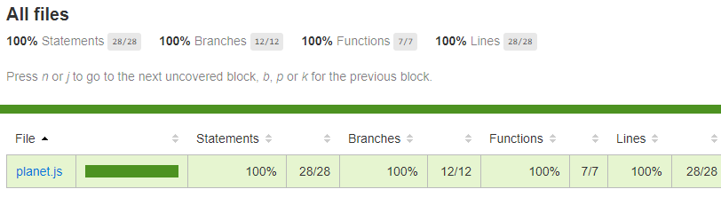

# **Galactic Age Calculator**
By _Olha Hizhytska_

Using this application user can know his age in 4 diferent planets: Mercury, Venus, Mars and Jupiter. Also the user can find out how much he has left to live on selected planet, according to the average life expectance in such planet.

## Technologies Used:

* JavaScript
* HTML/CSS/Bootstrap
* jQuery
* Node
* Npm
* Webpack
* Jest

## Description

This application demonstrates:
-  practicing OOP, using class. 
- creating modern development environments, using module bundling with Webpack, dependencies are managed using npm.
- using Test-driven development with Jest.
- 100% automated test coverage.

 

 
## Setup

- Clone this repository to your desktop, using next command:

  git clone https://github.com/OlgaHi/Galactic-Age-Calculator.git

- Navigate to the top level of the directory.

  cd Galactic-Age-Calculator

- Open in text editor to view code:
  -  Run the command `npm run install`

## Specifications

  
Expand Specs

### Describe: Planet()

| Test | Expect |
| ---- | ------ |
| Should correctly create a Mercury object with specified properties | (mercury.planetName).toEqual("Mercury");(mercury.earthUserAge).toEqual(36);(mercury.activityLevel).toEqual("never"); |
| Should calculate planetEarthYears for mercury object | (mercury.calculatePlanetEarthYears()).toEqual(88); |
| Should calculate planetEarthYears for venus object | (venus.calculatePlanetEarthYears()).toEqual(226); |
| Should calculate planetEarthYears for mars object | (mars.calculatePlanetEarthYears()).toEqual(686); |
| Should calculate planetEarthYears for jupiter object | (jupiter.calculatePlanetEarthYears()).toEqual(4329); |
| Should calculate and update property userPlanetAge for mercury object | (mercury.userPlanetAge).toEqual(149); |
| Should calculate and update property userPlanetAge for venus object | (venus.userPlanetAge).toEqual(132); |
| Should calculate and update property userPlanetAge for mars object | (mars.userPlanetAge).toEqual(19); |
| Should calculate and update property userPlanetAge for jupiter object | (jupiter.userPlanetAge).toEqual(3); |
| Should determine and update property userLifeExpectancy for mercury object | (mercury.userLifeExpectancy).toEqual(79); |
| Should determine and update property userLifeExpectancy for venus object | (venus.userLifeExpectancy).toEqual(80); |
| Should determine and update property userLifeExpectancy for mars object | (mars.userLifeExpectancy).toEqual(82); |
| Should determine and update property userLifeExpectancy for jupiter object | (jupiter.userLifeExpectancy).toEqual(82); |
| Should calculate and update property userPlanetLifeExpectancy for mercury object | (mercury.userPlanetLifeExpectancy).toEqual(328); |
| Should calculate and update property userPlanetLifeExpectancy for venus object | (venus.userPlanetLifeExpectancy).toEqual(129); |
| Should calculate and update property userPlanetLifeExpectancy for jupiter object | (jupiter.userPlanetLifeExpectancy).toEqual(7); |
| Should calculate and update property userPlanetLifeExpectancy for mars object | (mars.userPlanetLifeExpectancy).toEqual(44); |
| Should determine and update property leftOrSurpassed for mercury object | (mercury.leftOrSurpassed).toEqual(179); |
| Should determine and update property leftOrSurpassed for venus object | (venus.leftOrSurpassed).toEqual(-3); |
| Should determine and update property leftOrSurpassed for mars object | (mars.leftOrSurpassed).toEqual(25); |
| Should determine and update property leftOrSurpassed for jupiter object | (jupiter.leftOrSurpassed).toEqual(4); |
| Should determine and return if it is left or surpassed for mercury object | (mercury.determineLeftOrSurpass()).toEqual("Your age in Mercury is 149 years. The average life expectancy in Mercury is 328 years. It looks like you still have at least 179 years left to live! Hooray!"); |
| Should determine and return if it is left or surpassed for venus object | (venus.determineLeftOrSurpass()).toEqual("Your age in Venus is 132 years. You are already surpassed the average life expectancy in Venus, which is 129 years, for about up to 3 years. Congrats!"); |
| Should determine and return if it is left or surpassed for mars object | (mars.determineLeftOrSurpass()).toEqual("Your age in Mars is 19 years. The average life expectancy in Mars is 44 years. It looks like you still have at least 25 years left to live! Hooray!"); |
| Should determine and return if it is left or surpassed for jupiter object | (jupiter.determineLeftOrSurpass()).toEqual("Your age in Jupiter is 3 years. The average life expectancy in Jupiter is 7 years. It looks like you still have at least 4 years left to live! Hooray!"); |

## Known Bugs

- No known issues

## License

[MIT](https://en.wikipedia.org/wiki/MIT_License)
Copyright (c) 2021 _Olha Hizhytska_

## Contact Information

- Olha Hizhytska olgainfotech@gmail.com

