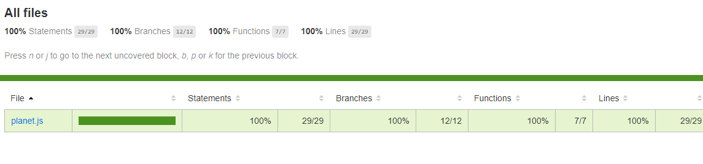

# **Galactic Age Calculator**
By Olha Hizhytska

Using this application user can know his age in 4 diferent planets: Mercury, Venus, Mars and Jupiter. Also the user can find out how much he has left to live on selected planet, according to the average life expectance in such planet.

## Technologies Used:

* JavaScript
* HTML/CSS/Bootstrap
* jQuery
* Node
* Npm
* Webpack
* Jest

## Description

This application demonstrates:
-  practicing OOP, using classes. 
- creating modern development environments, using module bundling with Webpack, dependencies are managed using npm.
- using Test-driven development with Jest.
- 100% automated test coverage.

 

 
## Setup

- Clone this repository to your desktop, using next command:

  git clone https://github.com/OlgaHi/Galactic-Age-Calculator.git

- Navigate to the top level of the directory.

  cd Galactic-Age-Calculator

- Open in text editor to view code:
  -  Run the command `npm run install`

## Specifications

  
Expand Specs

### Describe: Planet()

| Test | Expect |
| ---- | ------ |
| Should correctly create a Mercury object with specified properties | (mercury.planetName).toEqual("Mercury");(mercury.earthUserAge).toEqual(36) |
| Should calculate and update property planetEarthYears for mercury object | (mercury.planetEarthYears).toEqual(88); |

## Known Bugs

- No known issues

## License

[MIT](https://en.wikipedia.org/wiki/MIT_License)
Copyright (c) 2021 Olha Hizhytska

## Contact Information

- Olha Hizhytska olgainfotech@gmail.com

